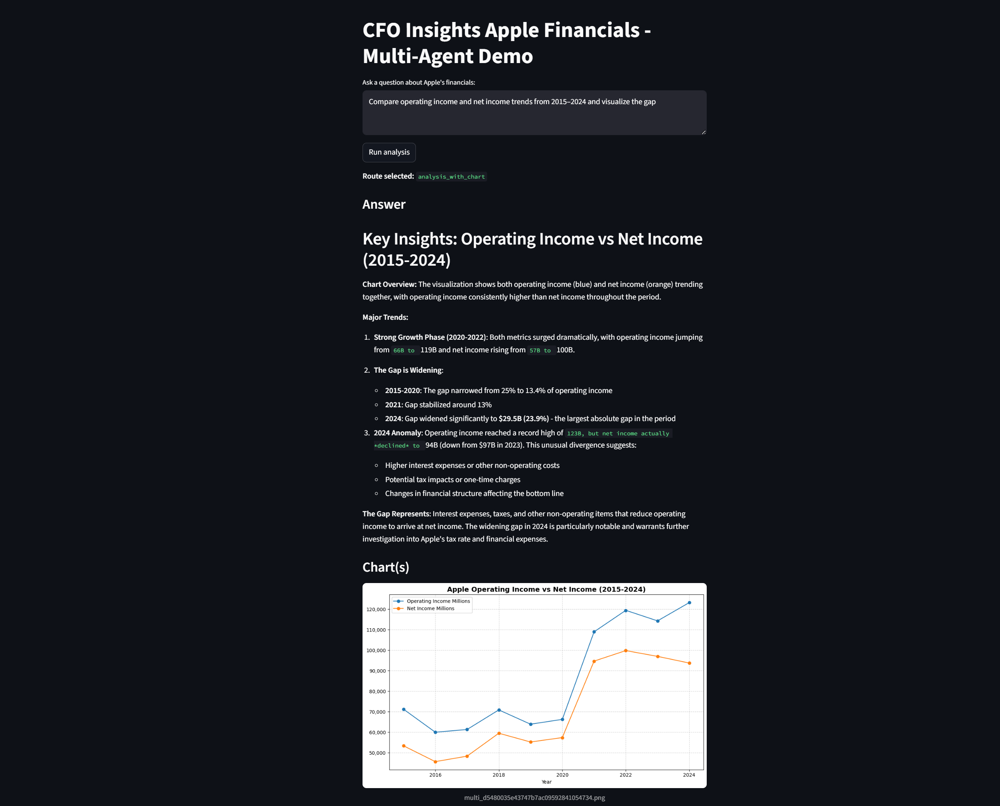
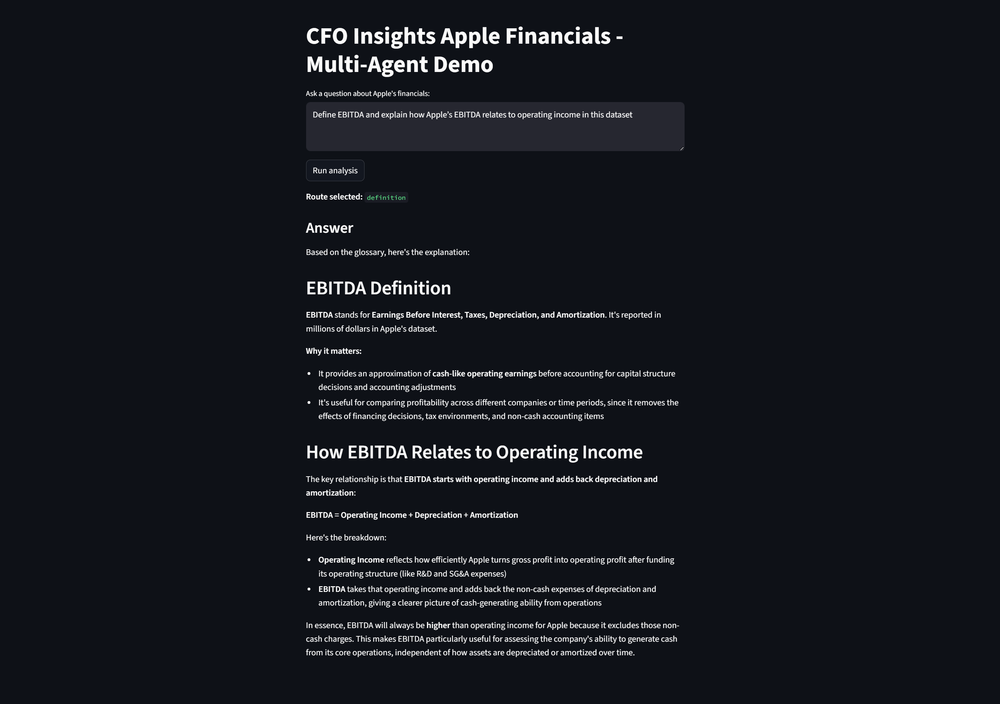

# CFO Insights – Apple Financials

CFO Insights is an agenticAI Streamlit app for exploring Apple’s annual financials (2009–2024) with grounded, data-backed answers. 
It combines DuckDB SQL analytics, LangGraph orchestration, and a Chroma-backed glossary RAG retriever to deliver metrics, trends, and clear financial definitions.

## Features
- Ask metric questions (YoY changes, multi-year trends, comparisons)
- SQL-powered analysis over the included Apple financial dataset via DuckDB
- “Definition” mode grounded on a finance glossary (RAG)
- Chart generation for time-series questions
- Multi-agent routing for analysis vs. definitions

## Prerequisites 
- Python 3.11 recommended
- An Anthropic API key
- Git

## Data
The app uses the following required data files:
- `data/apple_2009-2024.csv (main data set)`
- `data/glossary_apple_finance.md (RAG definition glossary)`

## Setup

### 1) Clone the repository
```bash
git clone https://github.com/tanayjain92/CFO-Insights
cd CFO-Insights
```

### 2) Create and activate a virtual environment

**Windows (PowerShell)**
```powershell
py -3.11 -m venv .venv
.venv\Scripts\Activate.ps1
```
**macOS/Linux**
```bash
python3 -m venv .venv
source .venv/bin/activate
```

### 3) Install dependencies
```bash
pip install -r requirements.txt
```

### 4) Configure environment variables
Create a `.env` file in the project root with your Anthropic key:
```
ANTHROPIC_API_KEY="please enter your anthropic key here"
```

## Run the app
```bash
streamlit run app.py
```
Then open the local URL printed by Streamlit

## Screenshots
**Operating income vs. net income (2015–2024)**



**EBITDA (RAG glossary)**


